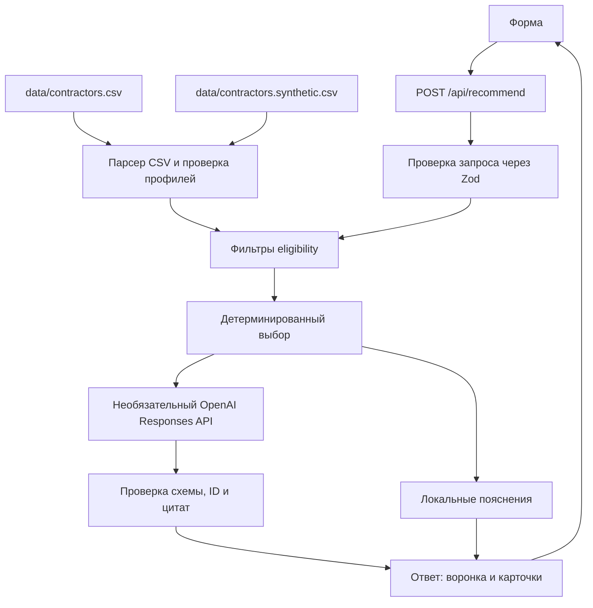

# Alem Match · HackAlem 2026

**Подбор до трёх подрядчиков мероприятий с понятными основаниями для каждого выбора.** Alem Match помогает организатору сравнить профили из существующего каталога; сервис не занимается поиском новых подрядчиков.

## Задача и решение

Пользователь задаёт город, дату, формат события, категорию и бюджет. При желании добавляет язык, длительность и текстовое пожелание. Сначала код проверяет обязательные условия и детерминированно выбирает до трёх подходящих профилей. Затем система показывает конкретные основания, а подключённый OpenAI может подготовить пояснение для уже выбранных профилей.

Ключевое разделение ответственности: **код решает, кто проходит условия и в каком порядке показывается; AI не фильтрует и не ранжирует подрядчиков.** Если OpenAI не настроен или не отвечает, остаются рекомендации и локальные пояснения.

## Что реализовано

- Жёсткий отбор по городу и категории, занятости в выбранную дату, формату, цене, а при указании — языку и длительности. Площадки проходят ту же проверку.
- Результаты `CATEGORY_NOT_FOUND` и `NO_ELIGIBLE_CANDIDATES` различаются. Если подходят один или два профиля, показываются только они с объяснением неполной выдачи.
- Выбор до трёх вариантов: по цене без текстового пожелания; по двум отдельным критериям — цене и локальному совпадению с пожеланием — если оно задано.
- Воронка отбора, структурированные причины исключения, объяснения и ограниченные однопараметрические подсказки при неполной/нулевой выдаче.
- Карточки показывают цену «от», поддерживаемые форматы и языки, доступные сведения о длительности, объяснение и отметки происхождения/восстановленных данных.

## Как работает подбор

```text
Параметры мероприятия
        ↓
Проверка запроса
        ↓
Город + категория → дата → формат → бюджет → язык → длительность
        ↓
Сравнение только прошедших профилей
        ↓
До 3 вариантов + воронка и основания
        ↓
Локальное пояснение или проверенное пояснение OpenAI
```

Занятый профиль исключается до выбора. Воронка показывает количество кандидатов после каждого шага; причины отказа относятся к первой проверке, которую профиль не прошёл. `SUCCESS` может содержать флаг `partial: true`, если результатов один или два. Отдельного статуса `PARTIAL_RESULT` в API нет.

При длительности `max_hours: null` означает, что поле длительности для профиля неприменимо; такой профиль не исключается и не обозначается как работающий неограниченное время. Отсутствие даты в `busy_dates` означает доступность только по имеющимся данным каталога.

## Как принимается решение

После фильтров детерминированный селектор использует нормированную эффективность бюджета. Если пожелание непустое, добавляется второй показатель — локальное совпадение слов и небольших заданных групп понятий между пожеланием и описанием профиля. Это лексическая эвристика, а не глубокое понимание текста.

При одном критерии кандидаты упорядочиваются по цене, при равенстве — по ID. При двух критериях применяется Pareto-сортировка: профиль доминирует другой, если он не хуже по обеим целям и строго лучше хотя бы по одной. Используются последовательные фронты; если места в выдаче не хватает, внутри текущего фронта отбираются крайние варианты и варианты с большим расстоянием до соседей (crowding distance). Итоговый порядок: Pareto-слой, роль выбора, цена и ID. Поэтому в выдаче с пожеланием могут быть варианты из более позднего фронта; не все карточки обязательно Pareto-недоминируемые.

AI вызывается только после выбора финалистов. Его формулировки не меняют eligibility, цели, shortlist или порядок.

## Роль AI

При заданном `OPENAI_API_KEY` сервер отправляет один запрос к OpenAI Responses API с максимум тремя уже выбранными профилями, условиями, структурированными фактами и ограниченными выдержками описания. Формат ответа задаётся через Zod Structured Outputs; результат включает текст и дословные цитаты. Код проверяет схему, полный и уникальный набор ID и то, что цитаты присутствуют в переданном описании. Непроверенный ответ не используется. Таймаут — 7 секунд, автоматические повторы отключены.

Модель не решает, подходит ли подрядчик, и не влияет на его место. Если ключа нет, для карточки строится детерминированное пояснение из цены, условий и текста профиля. Такой же режим используется при ошибке AI; подбор не требует OpenAI для запуска.

## Архитектура



## Технологии

- TypeScript, Next.js 16, React 19.
- `csv-parse` для CSV; Zod для проверки запросов, профилей и структурированного ответа модели.
- Официальный пакет `openai` и Responses API — только для пояснений.
- Node.js и npm для запуска, проверки и сборки.

## Данные и интеграции

В `data/contractors.csv` сохранены 66 профилей исходного каталога. Дополнительные 24 профиля лежат отдельно в `data/contractors.synthetic.csv`; все они имеют `synthetic: true`. После объединения приложение загружает 90 профилей в память процесса; всего 37 имеют флаг `synthetic: true`, включая 13 уже помеченных строк исходного CSV. Карточки визуально помечают синтетические профили. Исходный файл не перезаписывается.

Синтетический файл можно воспроизвести командой `npm run generate:synthetic`. Генератор использует фиксированный seed `0x0a1e2026`. Эти профили добавлены для расширения покрытия категорий Астаны и остаются демонстрационными данными, а не данными организаторов.

OpenAI — единственная внешняя интеграция; ключ используется только сервером. База данных, векторный поиск, бронирование и календарная интеграция не используются. В API-ответе есть статус AI; текст модели не влияет на подбор.

Сравнение исходного и дополненного каталога приведено в [отчёте покрытия](docs/DATASET_COVERAGE.md).

## Установка и запуск

Текущий checkout проверен на Node.js 24.2.0 и npm 11.3.0. В корне проекта:

```bash
npm ci
cp .env.example .env.local
npm run dev
```

Откройте <http://localhost:3000>. `.env.local` можно оставить без изменений: подбор и локальные пояснения работают без ключа. Чтобы включить пояснения OpenAI, задайте серверные переменные:

```dotenv
OPENAI_API_KEY=ваш_ключ
OPENAI_MODEL=gpt-4.1-mini
```

`OPENAI_MODEL` необязательна; код использует `gpt-4.1-mini` по умолчанию. Доступность модели зависит от настроек API-проекта. Не добавляйте ключ в переменные `NEXT_PUBLIC_*`.

Для локальной production-сборки:

```bash
npm run build
npm start
```

## Как проверить

Команда `npm run dev` открывает форму с готовыми пресетами. Выберите сценарий, проверьте заполненные поля и нажмите «Подобрать подрядчиков».

| Проверка | Город, дата | Формат и категория | Бюджет и опции | Ожидаемое поведение |
|---|---|---|---|---|
| Плотная категория | Алматы, `2026-10-15` | корпоратив, Ведущий | 1 500 000 ₸; пожелание: «Современный интеллигентный ведущий с импровизацией и юмором» | 3 карточки; стабильный порядок ID: `HK-44923`, `HK-29829`, `HK-77838`. Активны два критерия выбора. |
| Редкая категория | Алматы, `2026-10-15` | свадьба, Флорист | 300 000 ₸; длительность 10 ч | 2 карточки, без искусственного третьего результата. У флористов `max_hours: null`, поэтому длительность неприменима по каталогу. |
| Нет подходящих | Алматы, `2026-10-15` | корпоратив, Ведущий | 100 000 ₸ | `NO_ELIGIBLE_CANDIDATES`, 0 карточек и причины исключения. |
| Смена даты | Те же параметры плотного сценария, кроме даты | корпоратив, Ведущий | `2026-10-17`; остальные условия и пожелание плотного сценария | Занятый `HK-44923` исключается; IDs: `HK-77838`, `HK-35215`, `HK-44733`. |

Для проверки состояния `CATEGORY_NOT_FOUND` используйте параметры редкого сценария, заменив город на `Зарубежье`: в этой комбинации нет флористов.

При нуле или неполной выдаче API может предложить до двух проверенных изменений одного условия (бюджет, дата, длительность или язык). Например, для нулевой выдачи выше симуляция показывает, что бюджет 650 000 ₸ добавил бы один профиль. Каждое предложение симулируется теми же детерминированными фильтрами; подсказки не добавляют карточек к исходному ответу.

Обычный смешанный пример происхождения профилей: Астана, `2026-09-25`, свадьба, Видеограф, 700 000 ₸. В shortlist входят синтетический `SYN-10021` и профиль исходного файла `HK-10990`.

## Проверки проекта

```bash
npm test
npm run lint
npm run typecheck
npm run build
npm run demo
```

Тесты покрывают фильтры, статусы пустого и частичного результата, предел в три карточки, устойчивость порядка, Pareto-выбор, подсказки изменения условий, API, AI-границу и оба CSV. Обычный набор тестов не требует OpenAI API key или сети. `npm run demo` печатает результаты трёх основных пресетов и смешанного примера.

После запуска приложения HTTP-проверку выполняет:

```bash
node --import tsx scripts/smoke-api.ts
```

Реальные платные запросы OpenAI в `npm test` не входят. Отдельный ручной скрипт проверки — `scripts/verify-live.ts`.

## Структура проекта

```text
src/app/                  страница и API-маршрут
src/components/           форма, карточки и воронка
src/lib/data/              загрузка и проверка профилей
src/lib/recommendation/    фильтры, Pareto-выбор, подсказки, пояснения
src/lib/ai/                интеграция и проверка ответа OpenAI
data/                      исходный и отдельный синтетический CSV
scripts/                   демо, генератор и HTTP-проверка
tests/                     бизнес-правила, API и AI-граница
docs/                      отчёты проверок и покрытия каталога
```

## Ограничения

- Цена в каталоге — цена «от», а не согласованная смета; бронирования и подтверждения подрядчика нет.
- Доступность отражает только `busy_dates` в профилях и не подтверждается внешним календарём.
- Описания профилей не проверены независимо; синтетические профили — демонстрационные.
- Текстовое совпадение — небольшая локальная лексическая эвристика, а не полноценный семантический поиск; AI-пояснение остаётся генеративным текстом, хотя его схема, ID и цитаты проверяются.
- Каталог небольшой и загружается в память; проект не включает базу данных или поиск по крупному объёму данных.

## Дальнейшее развитие

Текущая версия работает с предоставленными полями каталога. Отдельно от реализованного функционала в будущем можно подключить подтверждённые календари и финальные цены, а для большого каталога — индексированный поиск.

## Демо

Публичная deployed-версия в текущем репозитории не настроена. Проект запускается локально по инструкции выше.
