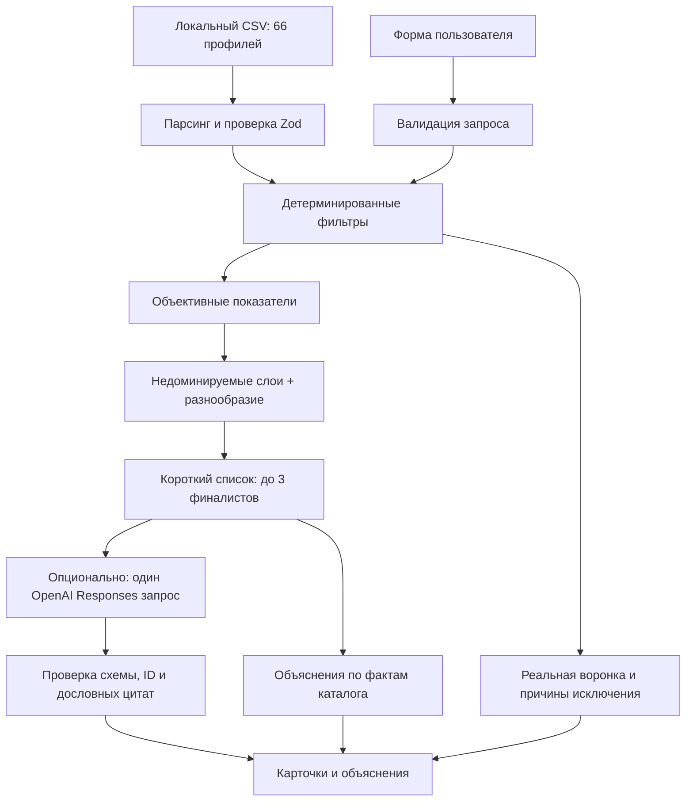

# Alem Match · HackAlem 2026

Веб-приложение для выбора **до трёх подрядчиков** из существующего каталога для события в Казахстане. Главный результат — понятное объяснение, почему конкретный профиль подходит под условия и пожелания. Интерфейс на русском; работает без API-ключа.

## Problem / Solution

Каталог уже существует: искать новых исполнителей не требуется. Нужно исключить неподходящих, сравнить оставшихся и показать проверяемые основания выбора.

**Deterministic software establishes eligibility and ranking truth. AI is constrained to qualitative interpretation and evidence-grounded explanation.**

Код проверяет город, категорию, дату, формат, бюджет, язык и длительность. После фильтров детерминированный Decision Frontier сравнивает экономию бюджета и, если пользователь задал пожелание, совпадение слов и понятий в описаниях. OpenAI получает только выбранные финалисты и пишет пояснения, не меняя состав или порядок. Автономные агенты, база данных и векторное хранилище для 66 профилей не нужны.



## Setup

Node.js **22.13+** или Node.js 24; npm. Проверено на Node 24.2.0. Зависимости зафиксированы в `package-lock.json`.

```sh
npm install
[ -f .env.local ] || cp .env.example .env.local
npm run dev
```

Открыть http://localhost:3000. Для установки строго по lock-файлу: `npm ci`.

```sh
npm run build
npm start
```

Никаких внешних шрифтов, изображений, БД или ключей для базового сценария не требуется. Каталог должен оставаться в `data/contractors.csv`. В конфигурации Next.js он включён в трассировку файлов API для серверного развёртывания; статический export для API не подходит. После изменения CSV перезапустите процесс и пересоберите приложение, чтобы обновились варианты формы.

### Environment variables

| Переменная | Назначение |
|---|---|
| `OPENAI_API_KEY` | Необязательный серверный ключ OpenAI. Пустой — локальные объяснения. |
| `OPENAI_MODEL` | Модель с Responses API и Structured Outputs; по умолчанию `gpt-4.1-mini`. Доступность зависит от API-проекта. |

Не используйте префикс `NEXT_PUBLIC_` для ключа. `.env*` исключены из git; исключение только `.env.example`. Ключ не выводится в журналы и не передаётся браузеру.

## Recommendation pipeline

1. Проверка входных данных через Zod, включая реально существующую календарную дату.
2. Категория **и** город: точное совпадение после нормализации регистра, пробелов и `ё/е`. `Зарубежье` не совпадает с Алматы или Астаной.
3. Исключение по `busy_dates`.
4. Проверка `event_formats`.
5. `price_from_kzt <= budgetKzt`.
6. Если указан язык, он должен быть в `languages`.
7. Если указана длительность и `max_hours != null`, проверка `durationHours <= max_hours`. В этом датасете `null` означает услугу, не привязанную к длительности присутствия; такой профиль не отклоняется и не выдаётся за «неограниченные часы».
8. Построение показателей цены и при наличии пожелания — локального совпадения слов/понятий; недоминируемая сортировка и выбор до 3 вариантов.
9. Объяснение из фактов; при наличии ключа — одна попытка AI-объяснения финалистов.

`rejectionReasons` учитывает **первую** причину отклонения каждого профиля. Причины не задваиваются: их сумма плюс число подходящих равна начальному числу категории/города. `funnel` показывает число после каждого этапа.

### Decision frontier / Determinism

У одного взвешенного балла есть скрытая цена компромисса: он объявляет кандидата «лучше» за счёт произвольных весов. Вместо этого подходящие профили получают два независимых показателя; Pareto-сортировка помещает профиль в следующий слой только если профили предыдущего слоя доминируют его.

```text
budgetEfficiencyBps = round((maxEligiblePrice - price) / (maxEligiblePrice - minEligiblePrice) * 10000)
preferenceFitBps = round(localSemantic.score * 10000)    только при непустом пожелании
```

Для бюджета значения нормализуются внутри текущего набора подходящих профилей: самая низкая цена получает 10 000, самая высокая — 0; если цены одинаковы, всем присваивается 10 000. Совпадение предпочтения — существующий локальный коэффициент: число совпавших уникальных терминов, делённое на число терминов пожелания. Текст нормализуется в NFKC, нижний регистр, `ё → е`; небольшой словарь основ хранится в `localSemantic.ts`, остальное сравнивается буквально. Это совпадение слов и понятий, а не глубокая семантика.

Кандидат доминирует другой, если не хуже по каждому активному показателю и строго лучше хотя бы по одному. Одинаковые векторы не доминируют друг друга. Если пожелание отсутствует, система использует одну цель — эффективность бюджета — и сортирует по ней, затем по цене и ID; стратегия честно отмечена как `SINGLE_OBJECTIVE`. При заданном пожелании активны две цели и стратегия `PARETO`.

Используются все Pareto-слои по порядку, пока не набраны три варианта. Если текущий слой шире оставшихся мест, crowding distance сохраняет крайние точки по каждой цели и предпочитает варианты с большим нормализованным расстоянием до соседей; равенство разрешается по цене ASC, затем ID ASC. Финальный порядок: слой ASC, метка решения (совпадение, экономия, альтернатива), цена ASC, ID ASC. Поэтому карточки не изображают один универсальный рейтинг. Метаданные ответа указывают стратегию, активные цели, слой, роль и значения целей в базисных пунктах. AI-оценки не участвуют в выборе.

Для crowding distance кандидаты группируются по одинаковому значению цели. Группы минимума и максимума получают `Infinity`; внутренние группы получают сумму `round((nextDistinct - previousDistinct) / objectiveRange * 10000)` по активным целям. Цель с нулевым диапазоном пропускается; если все цели постоянны, tie-break сводится к цене и ID. Реализация локальная, без оптимизационной библиотеки.

## API and result states

`POST /api/recommend`:

```json
{
  "city": "Алматы",
  "date": "2026-10-15",
  "eventFormat": "корпоратив",
  "category": "Ведущий",
  "budgetKzt": 1500000,
  "preference": "Современный интеллигентный ведущий с импровизацией и юмором"
}
```

Опциональны `durationHours`, `language`, `preference`; числа передаются JSON-числами. Пожелание ограничено 1500 символами. Неизвестные город/категория допустимы и дают пустое состояние, а не ошибку валидации.

- `SUCCESS`: 1–3 рекомендаций. **`partial: true`** при 1–2; отдельный `PARTIAL_RESULT` не используется согласно контракту запроса. UI явно объясняет ограниченную выдачу.
- `CATEGORY_NOT_FOUND`: ни одного профиля в комбинации город/категория.
- `NO_ELIGIBLE_CANDIDATES`: профили были, все исключены условиями.
- HTTP 400 + `INVALID_INPUT`: неверный JSON или поля.
- HTTP 500 + `SERVER_ERROR`: ошибка чтения/обработки каталога.

Ответ содержит `recommendations`, `funnel`, `rejectionReasons`, `summary`, `decision`, `counterfactuals`, `meta` (`totalProfiles`, `elapsedMs`, `aiElapsedMs` при вызове AI, `aiUsed`, `aiStatus`). `decision` сообщает стратегию `PARETO` или `SINGLE_OBJECTIVE` и активные цели. Рекомендация содержит исходный профиль, `hardMatches`, `matchedTerms`, цитаты, объяснение, `explanationSource` и `decisionMeta` (Pareto-слой, роль, показатели в базисных пунктах и экономию относительно самого дорогого выбранного профиля). Взвешенный балл больше не является полем рекомендации. `aiStatus` различает `disabled`, `skipped`, `used`, `unavailable`.

## AI integration and failure behavior

Официальный пакет `openai`, **Responses API**, `responses.parse` и Zod Structured Outputs. [Официальная документация Structured Outputs](https://developers.openai.com/api/docs/guides/structured-outputs).

Сервис из `src/lib/ai/openai.ts` вызывается только серверным маршрутом. В одном запросе передаются максимум 3 профиля: проверенные факты, релевантные локальные выдержки описания (при отсутствии совпадений — первые две фразы) и условия пользователя. Полный каталог и списки занятых дат не отправляются. Такой контекст ограничивает выводы о биографии и качествах, не относящихся к пожеланию. `store: false` отключает хранение response-объекта для последующего получения; это не утверждение о политике retention API.

Выход: `contractorId`, 1–3 дословные цитаты `evidence`, короткое `explanation`. Схема, полный набор ID, отсутствие дубликатов и буквальное присутствие цитат в описании проверяются кодом. Неизвестный ID, недостающий кандидат, выдуманная цитата, отказ, неполный ответ или неверная схема отклоняют весь AI-результат. Ответ модели никогда не меняет порядок карточек.

Таймаут SDK и abort-сигнал — **7 секунд**, автоматические повторы отключены. При ошибке возвращаются рассчитанные рекомендации с готовыми локальными объяснениями, HTTP 200. Без ключа это обычный режим, а не ошибка; при сбое подключённого AI интерфейс показывает спокойное уведомление. Для пустых результатов AI не вызывается. Браузер ограничивает ожидание запроса 15 секундами.

Проверка цитат гарантирует происхождение evidence, но не является формальным доказательством каждого утверждения свободного AI-текста. Prompt ограничивает его данными; исходные факты и цитаты доступны для проверки. Реальные запросы с `gpt-4.1-mini` проверены 23.09.2026 до внедрения Decision Frontier: финальная серия из пяти одинаковых запросов успешно прошла AI-валидацию за 4,49–4,84 с. Отдельно проверен отказ сервиса с HTTP 200 и fallback-карточками. В текущей версии тесты проверяют, что AI объясняет новый shortlist, не меняя выбранные ID или decision metadata. Подробности и аудит утверждений: [проверка перед freeze](docs/DEMO_VERIFICATION.md).

## Dataset

Оригинальный CSV не изменён: **66 уникальных ID**, 50 Алматы, 15 Астана, 1 Зарубежье; **13 синтетических** профилей; **9** с пустым `max_hours`. Списки сериализованы через `|`, булевы значения как `True/False`. `csv-parse` обрабатывает кавычки, запятые и переносы, Zod проверяет каждую строку; дубликаты ID или пустой каталог считаются ошибкой. Каталог кешируется в памяти процесса.

Сохраняются `synthetic`, `city_imputed`, `price_imputed`. Синтетические профили видимо маркированы; восстановленные город и цена отмечены на карточках. Один профиль может иметь несколько категорий, форматов и языков. Для обязательных условий структурированные поля имеют приоритет над рекламным описанием.

## Tests

```sh
npm test
npm run lint
npm run typecheck
npm run build
npm run demo
# При работающем сервере:
node --import tsx scripts/smoke-api.ts
# Опциональная платная проверка: пять реальных вызовов через работающий сервер
node --env-file=.env.local --import tsx scripts/verify-live.ts
```

Тесты не требуют сети или OpenAI-ключа. Покрыты hard filters, максимум 3, частичные/пустые состояния, Pareto dominance/layers/crowding, обе стратегии, стабильный порядок и значения, CSV и демо. AI-тесты проверяют изоляцию финалистов, неизменность ID и decision metadata, неизвестные/пропущенные/повторяющиеся ID, неподтверждённые цитаты, неверный ответ, сетевой сбой и fallback. Route-тесты проверяют HTTP-контракт. Smoke-скрипт проверяет работающий сервер.

## Demo Scenarios

Все сценарии подтверждены на исходном CSV. Кнопки в интерфейсе заполняют форму; затем нажмите «Подобрать подрядчиков». Для A и C дата **2026-10-15**, город **Алматы**, язык не задан.

| Сценарий | Категория / формат | Бюджет | Дополнительно | Проверенный результат |
|---|---|---:|---|---|
| A. Dense category | Ведущий / корпоратив | 1 500 000 ₸ | Пожелание ниже, длительность не задана | 10 → 8 свободны → 7 подходят → 3 Pareto-based choices |
| B. Rare category | Флорист / свадьба | 300 000 ₸ | 10 ч; пожелание пустое | 2 → 2 → 2; `SUCCESS`, `partial: true` |
| C. No result | Ведущий / корпоратив | 100 000 ₸ | Без длительности и пожелания | 0; `NO_ELIGIBLE_CANDIDATES` |

A: `Современный интеллигентный ведущий с импровизацией и юмором`.
Старая взвешенная сортировка выбирала `HK-44923`, `HK-77838`, `HK-35215`. Decision Frontier выбирает **Мицури Канроджи** (`HK-44923`), **Аню Форджер** (`HK-29829`) и **Хаула** (`HK-77838`): крайнее совпадение с пожеланием, экономичный вариант с нулевым локальным совпадением слов и более дорогой вариант с высоким совпадением. У Мицури слой 1 и совпадение 10 000 bps; Аня — слой 2, бюджет 9 231 bps, пожелание 0 bps; Хаул — слой 2, бюджет 4 615 bps, пожелание 7 500 bps. Это воспроизводимые лексические эвристики, не оценки качества. Исключены 2 по дате и 1 по формату.

B: **Тони Тони Чоппер** (`HK-39372`, от 200 000 ₸, восстановленная цена) и **Тихиро Огино** (`HK-90001`, от 250 000 ₸, синтетический профиль). Оба `max_hours: null` — 10 часов не исключают флористов.

C: из 10 профилей **2 заняты, 1 не поддерживает формат, 7 выше бюджета**. Никто не добавляется для заполнения карточек.

### D. Смена даты — проверка календаря

Сохраните **все параметры A**, включая пожелание, и измените только дату:

| Дата | ID в порядке выдачи |
|---|---|
| 2026-10-15 | `HK-44923`, `HK-29829`, `HK-77838` |
| 2026-10-17 | `HK-77838`, `HK-35215`, `HK-44733` |

Мицури (`HK-44923`) свободен по каталогу 15 октября, но 17 октября есть в его `busy_dates`; поэтому он исключается и появляется Буллма (`HK-44733`). Это подтверждено тестом на реальном CSV.

Дополнительная проверка `CATEGORY_NOT_FOUND`: B с городом `Зарубежье`.

## Counterfactual decision support

When fewer than three profiles qualify, the system can show up to two verified single-condition changes. Each simulation reruns the same deterministic eligibility filter; no LLM chooses or validates these changes. City, category, and event format are never relaxed. Budget uses ascending prices from the catalog, date checks the nearest qualifying day within ±14 days and the catalog's busy-date window (a later date wins equal-distance ties), duration checks actual lower `max_hours` thresholds when duration was requested, and language is tested only by removing the requested requirement. Suggestions are presented in the stable order budget, date, duration, language. These units are not combined into a made-up universal minimum.

## Decision Frontier

A single weighted score hides the trade-off between price and qualitative fit. When a non-empty preference is supplied, the system compares these two objectives independently. A profile is dominated only if another profile is at least as good on both objectives and strictly better on one. Equal vectors do not dominate. The selection uses successive Pareto layers; later layers fill the shortlist when earlier ones contain fewer than three profiles. When a layer must be truncated, crowding distance keeps objective extremes and favors candidates with more normalized distance from their neighbors. Ties resolve by price ascending, then ID ascending. Returned cards may therefore come from later layers; `decisionMeta.paretoRank` states the layer accurately.

The deterministic word-and-concept matcher is the only preference signal; it is not deep semantic understanding. With no non-empty preference, strategy becomes `SINGLE_OBJECTIVE`: candidates sort by normalized budget efficiency, then price and ID. The UI uses small role labels (preference anchor, more economical among remaining alternatives, alternative) rather than presenting a universal quality score. OpenAI only explains the already selected finalists.

At the current scale, 66 in-memory profiles are filtered first and the small eligible pool is compared locally. A larger production system could use indexed structured filtering and semantic candidate retrieval to reduce that pool, then reuse the same multi-objective selection. The current in-memory CSV implementation is not claimed to scale to millions of profiles as-is.

## Project structure

```text
src/app/                    страница, CSS, POST /api/recommend
src/components/             форма, карточка, воронка
src/lib/data/               CSV-парсер, нормализация, варианты формы
src/lib/validation/         схема запроса
src/lib/recommendation/     фильтры, Decision Frontier, локальный поиск, fallback
src/lib/ai/                 интерфейс, проверка AI-ответа, OpenAI SDK
src/lib/demoScenarios.ts    единые воспроизводимые сценарии
scripts/                   CLI-демо и HTTP smoke check
tests/                     бизнес-правила, AI-граница, API
```

## Limitations

- `price_from_kzt` — минимальная цена из каталога, не окончательная смета. Запас бюджета рассчитан от неё.
- Отсутствие даты в `busy_dates` считается доступностью **по каталогу**, без внешнего подтверждения. Данные календаря ограничены поставленным датасетом; даты за его пределами не подтверждают реальную занятость.
- Нет бронирования, оплат, переписки или обновления внешних календарей.
- Локальный поиск — небольшой словарь и совпадение слов, не embeddings и не полноценная семантика. Он не проверяет выполнение запретов и сложные пожелания; явные фразы после `без`, `не` (включая `не нужен`/`не хочу`), `никаких`, `избегать` исключаются до знака препинания, переноса строки или маркера списка. Их слова не повышают совпадение; положительная часть после запятой сохраняется. Отрицательные штрафы не применяются. Язык и длительность как обязательные условия задаются в отдельных полях.
- Описание — заявление профиля, не независимо проверенный факт. Качество и противоречия данных влияют на результат.
- Нет исторической статистики качества или конверсии. Совпадение слов и нормализация цены — эвристики выбора, не обученные оценки качества.
- Для публичного размещения потребуются лимиты запросов/расходов. Текущая версия рассчитана на локальное хакатон-демо.
